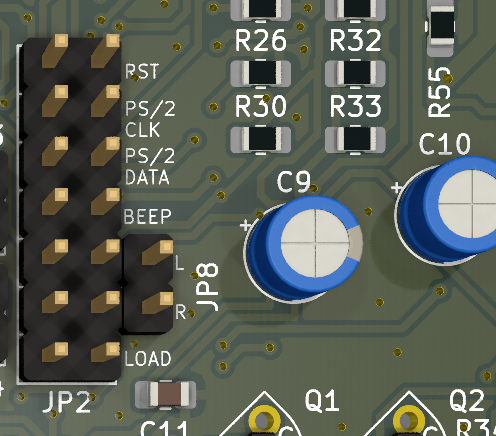

# FRANK

FRANK is a versatile hardware emulation platform based on Raspberry Pico and Raspberry Zero. It is a hardware fork of the [Murmulator](https://murmulator.ru/) project by Alex Ekb, incorporating numerous additional features.

The name "FRANK" is derived from "Frankenstein" as it integrates various components from different projects, similar to how Dr. Frankenstein created his monster from different body parts. This combination enables FRANK to offer a unique and powerful set of capabilities.

## Supported Platforms

FRANK supports emulation for a variety of platforms, including:

- **ZX Spectrum**: Emulates the classic 8-bit home computer, allowing users to run original ZX Spectrum software and games. It also supports enhanced versions of the ZX Spectrum with additional features.
- **Atari 800**: Supports emulation of the Atari 8-bit family of home computers.
- **NES**: Emulates the Nintendo Entertainment System, enabling users to play classic NES games.
- **Game Boy**: Provides emulation for the original Game Boy, Game Boy Color, and Game Boy Advance handheld consoles.
- **Sega Master System**: Emulates the Sega Master System home console.
- **Sega Game Gear**: Supports emulation of the Sega Game Gear handheld console.
- And many more.

These emulation capabilities make FRANK a versatile platform for retro computing enthusiasts and hobbyists.

## How to Build Your Own

You can order the PCBs from any manufacturer. JLCPCB is recommended, but you may choose any supplier. The FRANK PCB size is less than 10x10 cm, making production cost-effective.

You can download the Gerber files [here](./gerber/). The latest revision is 1.12.

The following parts are required to build your own FRANK:

| Reference | Value                  | Qty | Type               | AliExpress                                                                 |
|-----------|------------------------|-----|--------------------|----------------------------------------------------------------------------|
| AU1       | AUDIO OUT              | 1   | PJ-325C            | [Link](https://www.aliexpress.com/item/1005006710837751.html)               |
| AU2       | AUDIO IN               | 1   | PJ-325C            | [Link](https://www.aliexpress.com/item/1005006710837751.html)               |
| C1,C2,C3,C6 | 1u                   | 4   | Polar              | [Link](https://www.aliexpress.com/item/1005002524973878.html)               |
| C4,C7,C8,C14,C5,C13 | 100n         | 6   | SMD                | [Link](https://www.aliexpress.com/item/32964553793.html)                    |
| C9,C10,C15 | 10u                   | 3   | 0805               | [Link](https://www.aliexpress.com/item/32964553793.html)                    |
| C11,C12   | 10n                    | 2   | 0805               | [Link](https://www.aliexpress.com/item/32964553793.html)                    |
| C16       | 220u                   | 1   | Polar              | [Link](https://www.aliexpress.com/item/1005002524973878.html)               |
| CON1      | Display                | 1   | 2.54               | [Link](https://www.aliexpress.com/item/1005007039504981.html)               |
| CON2      | OUT                    | 1   | 2.54               | [Link](https://www.aliexpress.com/item/1005007039504981.html)               |
| CON3      | IN                     | 1   | 2.54               | [Link](https://www.aliexpress.com/item/1005007039504981.html)               |
| D1,D2,D3  | 1N4148                 | 3   | SOD-323            | [Link](https://www.aliexpress.com/item/1005007681952673.html)               |
| D4,D5,D6,D7,PWR2 | 3V3             | 5   | SOD-323            | [Link](https://www.aliexpress.com/item/32997486634.html)                    |
| DB1       | RS232                  | 1   | DB9 Female         | [Link](https://www.aliexpress.com/item/4000659356343.html)                  |
| DB2,DB3   | Joystick               | 2   | DB9 Female         | [Link](https://www.aliexpress.com/item/4000659356343.html)                  |
| HDMI1     | HDMI                   | 1   | Female 4 DIP       | [Link](https://www.aliexpress.com/item/1005005248842433.html)               |
| JP1       | JMP RUN                | 1   | 2.54               | [Link](https://www.aliexpress.com/item/1005007039504981.html)               |
| JP2       | Main Jumpers           | 1   | 2.54               | [Link](https://www.aliexpress.com/item/1005007039504981.html)               |
| JP3       | GP18 Jumper            | 1   | 2.54               | [Link](https://www.aliexpress.com/item/1005007039504981.html)               |
| JP4       | GP19 Jumper            | 1   | 2.54               | [Link](https://www.aliexpress.com/item/1005007039504981.html)               |
| JP5       | JMP PSRAM              | 1   | 2.54               | [Link](https://www.aliexpress.com/item/1005007039504981.html)               |
| JP6       | RS232 Jumpers          | 1   | 2.54               | [Link](https://www.aliexpress.com/item/1005007039504981.html)               |
| JP7,JP9,JP10 | RP ZERO +5V Jumper  | 3   | 2.54               | [Link](https://www.aliexpress.com/item/1005007039504981.html)               |
| JP8       | I2S                    | 1   | 2.54               | [Link](https://www.aliexpress.com/item/1005007039504981.html)               |
| KB1       | PS/2                   | 1   | PS/2 6P            | [Link](https://www.aliexpress.com/item/4000106131593.html)                  |
| L1        | LED                    | 1   | 0805               | [Link](https://www.aliexpress.com/item/838002118.html)                      |
| MAX1      | MAX232CSE+             | 1   | SO 16PIN           | [Link](https://www.aliexpress.com/item/1005006286473801.html)               |
| PSR1      | PSRAM                  | 1   | SOP8               | [Link](https://www.aliexpress.com/item/1005006440914173.html)               |
| PWR1      | 5V                     | 1   | 2.54               | [Link](https://www.aliexpress.com/item/1005007039504981.html)               |
| Q1,Q2     | BC850                  | 2   | SOT-23             | [Link](https://www.aliexpress.com/item/33017911878.html)                    |
| R1,R2,R11,R35,R36,R37,R38,R55 | 1K | 8   | 0805               | [Link](https://www.aliexpress.com/item/1005005600798857.html)               |
| R3,R4,R5,R6,R7,R8,R9,R10,R40,R41,R42,R43,R44,R45 | 270R | 14 | 0805 | [Link](https://www.aliexpress.com/item/1005005600798857.html)               |
| R12,R13,R14,R25,R26 | 330R         | 5   | 0805               | [Link](https://www.aliexpress.com/item/1005005600798857.html)               |
| R15,R16,R17,R30,R33 | 1k           | 5   | 0805               | [Link](https://www.aliexpress.com/item/1005005600798857.html)               |
| R18,R19,R20,R21,R27,R28,R29,R34 | 10K | 8 | 0805               | [Link](https://www.aliexpress.com/item/1005005600798857.html)               |
| R22,R23,R24,R47,R48 | 100R         | 5   | 0805               | [Link](https://www.aliexpress.com/item/1005005600798857.html)               |
| R31,R32   | 2k                     | 2   | 0805               | [Link](https://www.aliexpress.com/item/1005005600798857.html)               |
| R39       | 750R                   | 1   | 0805               | [Link](https://www.aliexpress.com/item/1005005600798857.html)               |
| R46       | 300R                   | 1   | 0805               | [Link](https://www.aliexpress.com/item/1005005600798857.html)               |
| R49,R50,R51,R52,R53 | 150R         | 5   | 0805               | [Link](https://www.aliexpress.com/item/1005005600798857.html)               |
| R54       | 51R                    | 1   | 0805               | [Link](https://www.aliexpress.com/item/1005005600798857.html)               |
| R56,R57   | 5.1K                   | 2   | 0805               | [Link](https://www.aliexpress.com/item/1005005600798857.html)               |
| RP1       | RP2040 Pico            | 1   | Pico               | [Link](https://www.aliexpress.com/item/1005006055009344.html)               |
| RP2       | RP 2040 Zero           | 1   | Zero               | [Link](https://www.aliexpress.com/item/1005006354505058.html)               |
| SC1       | VIDEO (Soft Composite) | 1   | RCA-103            | [Link](https://www.aliexpress.com/item/1005006152724809.html)               |
| SD1       | Micro SD               | 1   | Push-Push          | [Link](https://www.aliexpress.com/item/1005004214252441.html)               |
| SW1       | SW_Push_Dual           | 1   | 3 x 3 x 1.5 mm     | [Link](https://www.aliexpress.com/item/1005001629293584.html)               |
| TDA1      | TDA1387T               | 1   | SOP-8              | [Link](https://www.aliexpress.com/item/32995595000.html)                    |
| UART1     | UART                   | 1   | 2.54               | [Link](https://www.aliexpress.com/item/1005007039504981.html)               |
| USB1      | USB Type C             | 1   | 16 Pin SMT         | [Link](https://www.aliexpress.com/item/1005005500797563.html)               |
| VGA1      | VGA                    | 1   | DB15 Female 90 Degree | [Link](https://www.aliexpress.com/item/32842951548.html)                  |

## Jumpers

There are several jumpers on the PCB that enable or disable various functionalities of the FRANK.

### JP1

Connects RUN and RST pins of the Pico. Usually, this is not connected.

### JP2

These are the main jumpers that enable some of the core features.

*Important*: Connect jumpers horizontally; each row represents its own switch.

| Jumper     | Description                                |
|------------|--------------------------------------------|
| RST        | Connect RST to GPIO23 of the Pico          |
| PS/2 CLK   | Enable PS/2 Keyboard (connect CLK pin)     |
| PS/2 DATA  | Enable PS/2 Keyboard (connect DATA pin)    |
| BEEP       | Enable beeper (connect BEEP_OUT to GPIO28) |
| L          | Enable left audio out channel              |
| R          | Enable right audio out channel             |
| LOAD       | Enable tape loading functionality          |

The audio part is a bit complex. If you solder the TDA chip, enable it by connecting the second pins of JP2's "L" and "R" jumpers to JP8.

### JP3, JP4, and JP5

Connect JP3, JP4, and JP5 jumpers to enable PSRAM if you have it. If you do not wish to solder the PSRAM chip, leave the JP5 jumper as is.

### JP6

These jumpers should be connected if you intend to use the RS232 functionality of the FRANK. Each of the four switches connects the corresponding pins of Pico and MAX232.

*Note*: RS232 shares GPIO16 and GPIO17 of the Pico, which are also used by the gamepad.

### JP7

This jumper enables the second gamepad.

### JP8

This jumper enables the first gamepad.

*Note*: RS232 shares GPIO16 with the first gamepad. It might be advisable to remove this jumper if you intend to use RS232.